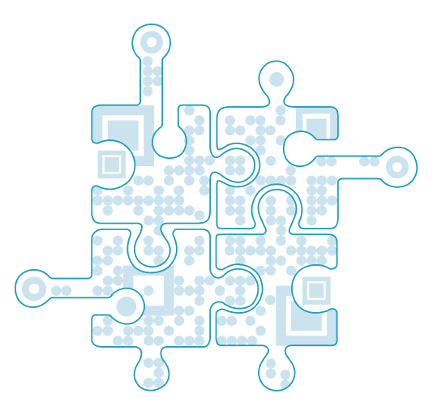

<!-- markdownlint-configure-file {
  "MD041": false
} -->

# 🤝 **PoN - Web3 Business Card - : EthLisbon 2022**

## Table of contents 📌

-   [🚀 **Statement**](#-statement)
-   [🎬 **Pitch & Live Demo (Video)**](#-pitch--live-demo-video)
-   [💬 **Problem**](#-problem)
-   [💬 **Current Alternatives**](#-current-alternatives)
-   [💡 **Solution**](#-solution)
-   [💻 **How we made it**](#-how-we-made-it)
    -   [Technological Implementation](#technological-implementation)
        -   [Tech Stack](#tech-stack)
        -   [Easy web3 profile creation and instantly sharing information](#easy-web3-profile-creation-and-instantly-sharing-information)
        -   [Verifiable connections](#verifiable-connections)
    -   [Technical details](#technical-details)
-   [✨ **Potential of the app usecase**](#-potential-of-the-app-usecase)
-   [📓 **Appendix**](#-appendix)
    -   [Our Product Roadmap](#our-product-roadmap)
        -   [Launch Officially on Mobile App like iOS and Android](#launch-officially-on-mobile-app-like-ios-and-android)
    -   [Team Members](#team-members)
    -   [Resources](#resources)

## 🚀 **Statement**

**We are eager to continue the project after the hackathon in order to actually launch it in the world. We wanted ETH Lisbon as a new addition to our existing project and have received an endorsement from ETH Lisbon that we are eligible for some awards.**

## 🎬 **Pitch & Live Demo (Video)**

We are decentralized business card. We collect and aggregate all of your off-chain and on-chain profile to create your web3 identity to help people connect easier while attending web3 conferences and events. The end goal is to create a reputation ecosystem to replace web2 platforms like LinkedIn and Eventbright.

    

## 💬 **Problem：Networking at Web3 events.**

- Difficult to find people who you want to meet at the events.
- Difficult to exchange personal profiles and contact information.
- It’s challenging to keep track of events.

## 💡 **Solution：Networking dapp for Web3 events**

- See all attendees’s profile at the event.
- Exchange profiles by scanning each other’s QR code, or via one link
- Find all Web3-related events in one place.

## 💻 **How we made it**

### Technological Implementation

#### Tech Stack

-   Front-End: Nextjs, React, Typescript, WalletConnect/web3modal,
-   Mobile: ReactNative, React, WalletConnect
-   Data: Ceramic, Lit Protocol with Orbis-SDK, IPFS, Arweave
-   Blockchain: We prepared deployment on Polygon, Gnosis, Cronos, Near.

## **①Deploy SBT to Blockchain**

- **Gnosis**：For users to deploy SBT because of . 

➜ pnpm run -F sol deploy:network gnosis 

> @business-card/sol@0.0.1 deploy:network /Users/otto/box/code/pon/libs/sol
> hardhat run scripts/10-deploy-sb-v1.ts --network "gnosis"

Soulbound deployed to: 0x49Dc775EbBbCf099a671f0E39587798281A89a4f , at chain: 100

- **Cronos**：For users to deploy SBT because of low transaction cost. 

- **Near**：For users to deploy SBT because of low transaction cost. 

- **Polygon**：For users to deploy SBT because of low transaction cost. 

- **The Graph**：To build the SBTs gallery for each user profile so the user can see the information almost instantly by subgraph, in the future we can also leverage it to get aggregated information about minted SBTs or other statistical data. SubGraph is [here](https://thegraph.com/studio/subgraph/soulboundimplementation/).

### Technical details

-   The Soulbound tokens and their characteristics: non transferable but burnable to avoid spam.
-   The Etherum standards we based the product on: ERC712 for signature verifications, ERC4973 for SBTs and contracts upgradeable with UUPS.
-   The signatures are stored off-chain and encrypted with Threshold cryptography thanks to Lit protocol, any sensitive data is encrypted that way as well.
-   Part of the data relevant to encounter goes onchain when a user decides to mint the SBT to proof the encounter.
-   We built universal apps for web (nextjs) and mobile (ios, android).

## ✨ **Potential of the app usecase**

We are studying mechanisms to use the reputation for example, to get undecollateralized loans.

## 📓 **Appendix**

### Our Product Roadmap

#### Launch Officially on Mobile App like iOS and Android

How is this product creative and unique:

-   To make Web3 social products a product market fit for consumers, it is necessary to achieve a better UX, and a mobile experience is essential to this. There are only few projects in the industry that are able to combine data portability and mobile.

### Resources

-   [Demo1: Mobile use](https://www.youtube.com/watch?v=cTG88Kcmj1A)
